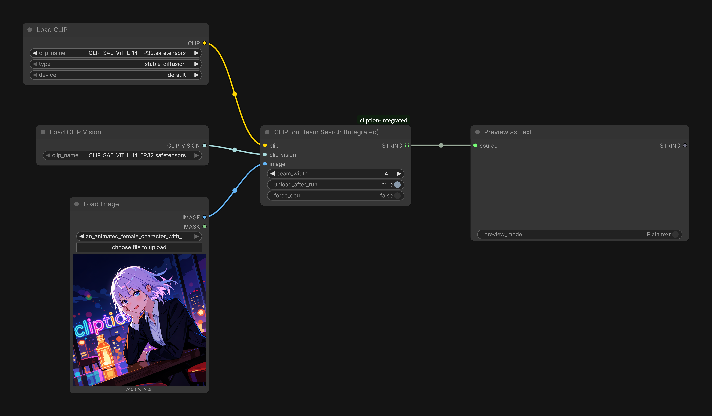

<div align="center">

</div>

# ComfyUI-cliption-integrated

A streamlined fork of [pharmapsychotic/comfy-cliption](https://github.com/pharmapsychotic/comfy-cliption) for ComfyUI, providing a single, integrated **CLIPtion Beam Search** node.

[CLIPtion](https://github.com/pharmapsychotic/CLIPtion) is a fast, lightweight image captioning model built on top of CLIP. This fork updates it for ComfyUI's V3 node scheme and consolidates the node pack into a single, integrated node. Processing has been sped up for GPU inference, and a VRAM offload option has been added.

## Node

### CLIPtion Beam Search (Integrated)

<div align="center">

</div>

Loads the CLIPtion decoder on demand at caption time (rather than at workflow-load time) and runs beam search to caption an image, ranking the resulting candidates by CLIP similarity to the input image.

**Inputs**

| Name | Type | Description |
| --- | --- | --- |
| `clip` | `CLIP` | CLIP text encoder (must include CLIP-L). |
| `clip_vision` | `CLIP_VISION` | CLIP vision encoder (must be CLIP-L). |
| `image` | `IMAGE` | Image to caption. |
| `beam_width` | `INT` | Number of beams to maintain during search (default: 4). |
| `unload_after_run` | `BOOLEAN` | Unload the CLIPtion decoder from VRAM after captioning (default: False). |
| `device` (optional) | `["default", "cpu"]` | Inference device override. |

**Output**

| Name | Type | Description |
| --- | --- | --- |
| `STRING` | `STRING` (list) | Generated caption. |

The CLIPtion decoder weights (`CLIPtion_20241219_fp16.safetensors`) are downloaded automatically from [easygoing0114/ComfyUI-use-models](https://huggingface.co/easygoing0114/ComfyUI-use-models/tree/main) on Hugging Face the first time the node runs, and are saved to `ComfyUI/models/cliption` for reuse on subsequent runs. You can also place a copy of the file in that folder yourself ahead of time to skip the automatic download.

### Recommended CLIP-L model

For the `clip` and `clip_vision` inputs, we recommend [zer0int/CLIP-SAE-ViT-L-14](https://huggingface.co/zer0int/CLIP-SAE-ViT-L-14), a free, high-accuracy fine-tune of CLIP ViT-L/14 released by zer0int. This model has also been mirrored to the [easygoing0114/ComfyUI-use-models](https://huggingface.co/easygoing0114/ComfyUI-use-models/tree/main) repository above.

Download `CLIP-SAE-ViT-L-14_FP32.safetensors` and place it in **both** of the following folders:

- `ComfyUI/models/text_encoders`
- `ComfyUI/models/clip_vision`

## Installation

```
cd ComfyUI/custom_nodes
git clone https://github.com/easygoing0114/ComfyUI-cliption-integrated.git
```

Restart ComfyUI. The node should now appear in the node search as **CLIPtion Beam Search (Integrated)**.

## Credits

- [pharmapsychotic/comfy-cliption](https://github.com/pharmapsychotic/comfy-cliption) — original ComfyUI node pack this fork is based on.
- [pharmapsychotic/CLIPtion](https://huggingface.co/pharmapsychotic/CLIPtion) — the underlying CLIPtion model.
- [zer0int/CLIP-SAE-ViT-L-14](https://huggingface.co/zer0int/CLIP-SAE-ViT-L-14) — recommended high-accuracy CLIP-L model, freely released by zer0int.

## License

This project is licensed under the MIT License.